# 依存関係アーキテクチャ図

`src/` 配下のモジュール依存関係を [dependency-cruiser](https://github.com/sverweij/dependency-cruiser) で解析し、ディレクトリ単位に集約した図です。

## 生成方法

```bash
npx depcruise src \
  --no-config \
  --ts-config tsconfig.json \
  --ts-pre-compilation-deps \
  --output-type json \
  --do-not-follow "node_modules" \
  --exclude "node_modules|[.]test[.]js$"
```

- `--ts-config tsconfig.json` で `@/*` → `./src/*` のパスエイリアスを解決しています。
- 除外対象: `node_modules`、`*.test.js`、テスト用ヘルパー `src/test/`。
- TypeScript への段階移行中のため `.js` と `.ts` が混在します。`--ts-pre-compilation-deps` を付けているので、`import type` による型のみの依存もエッジとして数えています（付けないと `database.types.ts` が孤立ファイルに見えます）。
- 解析対象ファイル数: **234** / 集約ノード数: **57** / 集約エッジ数: **126**
- 解析日: 2026-09-13（dependency-cruiser v18.2.0）

## 凡例

- ノードのラベルは `src/` を省いたディレクトリパス。括弧内の数字は**そのノードに集約されたファイル数**。
- エッジのラベルは**そのディレクトリ間の import 本数**（3 本以上のみ表示）。
- <span style="color:#dc2626">赤の太線・赤枠のノード</span>は**双方向依存（循環）**。
- 集約ルール: `src/app/api/<name>`、`src/app/(group)/<route>`、`src/components/dashboard/<name>`、`src/components/<name>`、`src/lib/<name>` の単位でまとめ、それより深い階層は親に畳み込んでいます。

## 図

```mermaid
graph LR
  subgraph L0["L0: ミドルウェア"]
    n55["middleware<br/>(1)"]
  end
  subgraph L1a["L1a: ルート（公開 / (main)）"]
    n0["app<br/>(4)"]
    n2["app/(main)<br/>(2)"]
    n3["app/(main)/articles<br/>(3)"]
    n4["app/(main)/concept<br/>(1)"]
    n5["app/(main)/contact<br/>(2)"]
    n6["app/(main)/forCompanies<br/>(1)"]
    n7["app/(main)/login<br/>(2)"]
    n8["app/(main)/lp-temp<br/>(1)"]
    n9["app/(main)/mentors<br/>(1)"]
    n10["app/(main)/recruitment<br/>(1)"]
    n11["app/(main)/reset<br/>(2)"]
    n12["app/(main)/signup<br/>(5)"]
    n29["app/privacy<br/>(1)"]
  end
  subgraph L1b["L1b: ルート（認証エリア / (userPage)・(admin)）"]
    n1["app/(admin)<br/>(1)"]
    n13["app/(userPage)<br/>(1)"]
    n14["app/(userPage)/dashboard<br/>(30)"]
    n15["app/(userPage)/error<br/>(1)"]
    n16["app/(userPage)/resetPass<br/>(2)"]
    n17["app/(userPage)/setAccount<br/>(6)"]
  end
  subgraph L2["L2: API ルート"]
    n18["app/api/article<br/>(1)"]
    n19["app/api/auth<br/>(5)"]
    n20["app/api/checkout_sessions<br/>(1)"]
    n21["app/api/draft<br/>(1)"]
    n22["app/api/exit_draft<br/>(1)"]
    n23["app/api/livekit-token<br/>(1)"]
    n24["app/api/meeting<br/>(1)"]
    n25["app/api/mentor<br/>(2)"]
    n26["app/api/r2_upload<br/>(1)"]
    n27["app/api/revalidate<br/>(1)"]
    n28["app/api/webhooks<br/>(3)"]
  end
  subgraph L3["L3: コンポーネント（サイト共通・マーケティング）"]
    n30["components<br/>(3)"]
    n31["components/articles<br/>(4)"]
    n32["components/common<br/>(3)"]
    n45["components/headerComponents<br/>(3)"]
    n46["components/home<br/>(10)"]
    n47["components/lpTemp<br/>(16)"]
    n48["components/mentors<br/>(3)"]
    n49["components/recruitment<br/>(10)"]
  end
  subgraph L4["L4: コンポーネント（ダッシュボード）"]
    n33["components/dashboard<br/>(6)"]
    n34["components/dashboard/admin<br/>(12)"]
    n35["components/dashboard/appointment<br/>(6)"]
    n36["components/dashboard/chat<br/>(5)"]
    n37["components/dashboard/common<br/>(3)"]
    n38["components/dashboard/livekit-token<br/>(4)"]
    n39["components/dashboard/mentor<br/>(17)"]
    n40["components/dashboard/organization<br/>(1)"]
    n41["components/dashboard/profile<br/>(3)"]
    n42["components/dashboard/review<br/>(1)"]
    n43["components/dashboard/setup<br/>(2)"]
    n44["components/dashboard/user<br/>(10)"]
  end
  subgraph L5["L5: UI プリミティブ（shadcn/ui）"]
    n50["components/ui<br/>(6)"]
  end
  subgraph L6["L6: ライブラリ / ユーティリティ"]
    n51["lib<br/>(10)"]
    n52["lib/auth<br/>(1)"]
    n53["lib/supabase<br/>(5)"]
    n54["lib/validation<br/>(3)"]
    n56["utils<br/>(1)"]
  end

  n1 --> n0
  n1 --> n33
  n3 -->|5| n31
  n5 --> n56
  n7 --> n50
  n7 --> n53
  n7 --> n56
  n8 --> n30
  n8 -->|9| n46
  n9 --> n32
  n9 --> n48
  n9 --> n51
  n9 --> n53
  n10 -->|10| n49
  n11 --> n50
  n11 --> n51
  n11 --> n53
  n11 --> n56
  n12 --> n51
  n12 -->|6| n53
  n12 -->|4| n56
  n2 --> n0
  n2 --> n30
  n2 -->|13| n47
  n2 --> n51
  n2 --> n53
  n14 --> n33
  n14 ==>|4| n34
  n14 --> n36
  n14 --> n38
  n14 -->|5| n39
  n14 ==> n40
  n14 --> n42
  n14 ==> n44
  n14 --> n50
  n14 -->|7| n51
  n14 --> n52
  n14 -->|30| n53
  n14 -->|3| n56
  n16 --> n50
  n16 --> n53
  n17 --> n39
  n17 --> n41
  n17 --> n44
  n17 -->|3| n53
  n17 --> n54
  n13 --> n0
  n13 --> n33
  n19 -->|3| n53
  n19 -->|3| n56
  n20 --> n51
  n20 --> n53
  n23 --> n53
  n24 --> n53
  n25 --> n51
  n25 --> n53
  n26 --> n51
  n26 --> n53
  n28 --> n51
  n28 --> n53
  n0 --> n30
  n0 --> n50
  n31 --> n50
  n32 -->|3| n51
  n34 ==> n14
  n34 -->|3| n32
  n34 --> n33
  n34 --> n35
  n34 -->|4| n41
  n34 --> n50
  n34 --> n51
  n35 --> n33
  n35 --> n41
  n35 --> n53
  n36 --> n50
  n36 -->|3| n51
  n36 -->|3| n53
  n36 --> n56
  n38 --> n56
  n39 --> n35
  n39 --> n37
  n39 -->|5| n41
  n39 -->|6| n50
  n39 -->|5| n51
  n39 -->|4| n53
  n39 --> n54
  n39 --> n56
  n40 ==> n14
  n41 --> n51
  n41 --> n53
  n41 -->|3| n54
  n42 --> n50
  n44 ==> n14
  n44 --> n32
  n44 --> n33
  n44 --> n35
  n44 --> n37
  n44 -->|5| n41
  n44 --> n48
  n44 -->|3| n50
  n44 --> n51
  n44 --> n53
  n33 --> n30
  n33 --> n41
  n33 --> n50
  n33 --> n53
  n45 --> n50
  n46 --> n30
  n46 --> n31
  n46 -->|5| n32
  n46 -->|3| n50
  n46 -->|3| n51
  n46 --> n53
  n47 --> n41
  n47 --> n48
  n47 -->|4| n50
  n48 --> n32
  n48 --> n41
  n48 --> n50
  n50 -->|5| n51
  n30 --> n41
  n30 --> n45
  n30 --> n50
  n30 --> n53
  n52 --> n53
  n55 --> n53

  classDef cyc fill:#fee2e2,stroke:#dc2626,stroke-width:2px,color:#7f1d1d;
  class n14,n34,n40,n44 cyc;
  linkStyle 27,31,33,64,87,92 stroke:#dc2626,stroke-width:2.5px;
```



## 双方向依存（循環）

ディレクトリ単位で見たとき、以下の **3 組**が相互依存しています。

- **`src/app/(userPage)/dashboard`  ⇄  `src/components/dashboard/admin`**
  - `src/app/(userPage)/dashboard` → `src/components/dashboard/admin` (4 本)
    - `src/app/(userPage)/dashboard/admin/chat/[meetingId]/page.js` → `src/components/dashboard/admin/AdminChatViewer.js`
    - `src/app/(userPage)/dashboard/admin/mentors/page.js` → `src/components/dashboard/admin/AdminMentorList.js`
    - `src/app/(userPage)/dashboard/admin/organizations/page.js` → `src/components/dashboard/admin/AdminOrganizations.js`
    - `src/app/(userPage)/dashboard/admin/page.js` → `src/components/dashboard/admin/AdminDashboard.js`
  - `src/components/dashboard/admin` → `src/app/(userPage)/dashboard` (2 本)
    - `src/components/dashboard/admin/AdminMentorList.js` → `src/app/(userPage)/dashboard/admin/mentors/actions.js`
    - `src/components/dashboard/admin/AdminOrganizations.js` → `src/app/(userPage)/dashboard/admin/organizations/actions.js`
- **`src/app/(userPage)/dashboard`  ⇄  `src/components/dashboard/organization`**
  - `src/app/(userPage)/dashboard` → `src/components/dashboard/organization` (1 本)
    - `src/app/(userPage)/dashboard/organization/page.js` → `src/components/dashboard/organization/OrganizationOwnerDashboard.js`
  - `src/components/dashboard/organization` → `src/app/(userPage)/dashboard` (1 本)
    - `src/components/dashboard/organization/OrganizationOwnerDashboard.js` → `src/app/(userPage)/dashboard/organization/actions.js`
- **`src/app/(userPage)/dashboard`  ⇄  `src/components/dashboard/user`**
  - `src/app/(userPage)/dashboard` → `src/components/dashboard/user` (1 本)
    - `src/app/(userPage)/dashboard/user/page.js` → `src/components/dashboard/user/UserDashboard.js`
  - `src/components/dashboard/user` → `src/app/(userPage)/dashboard` (1 本)
    - `src/components/dashboard/user/OrganizationJoin.js` → `src/app/(userPage)/dashboard/organization/join/actions.js`

### 補足

- **ファイル単位では循環 import は 1 件もありません**（強連結成分の探索結果は空、自己 import も 0）。上記はいずれも「ページ（`page.js`）がコンポーネントを import し、そのコンポーネントが `src/app` 側に置かれた Server Action（`actions.js`）を import し返す」という Next.js App Router の構成によるもので、ディレクトリ単位に集約したときだけ双方向に見える依存です（`src/components/dashboard/user/OrganizationJoin.js` → `dashboard/organization/join/actions.js` のように、別ルートの Server Action を参照しているケースも含みます）。
- 循環を実際に解消したい場合は、Server Action を `actions.js` からコンポーネント側（または `src/lib`）へ寄せるのが最小の変更になります。

## 解析メモ

### 解決できなかった import（図には含まれません）

- `src/components/dashboard/mentor/PdfSlider.js` → `swiper/css`
- `src/components/dashboard/mentor/PdfSlider.js` → `swiper/css/navigation`
- `src/components/dashboard/mentor/PdfSlider.js` → `swiper/react`
- `src/app/layout.js` → `@vercel/speed-insights/next`

いずれも npm パッケージのサブパス export（`package.json` の `exports` 経由）で、dependency-cruiser が追跡しないだけです。実体が存在しない import はありません。

### どこからも import されていないファイル

エントリポイント（`page.js` / `layout.js` / `route.js` / `actions.js` / `middleware.js` 等）以外で、被参照が 0 のファイル:

- `src/components/dashboard/admin/AdminAppointmentTab.js`
- `src/components/dashboard/admin/AdminAppointmentUnitPast.js`
- `src/components/dashboard/admin/AdminProfile.js`
- `src/components/dashboard/admin/AdminSidebar.js`
- `src/components/dashboard/appointment/appointment.js`
- `src/components/dashboard/setup/setupMentor.js`
- `src/components/dashboard/setup/setupUser.js`
- `src/components/dashboard/sidebar.js`
- `src/components/ui/drawer.jsx`

## 集約ノード一覧

| ディレクトリ | ファイル数 |
| --- | --- |
| `src/app` | 4 |
| `src/app/(admin)` | 1 |
| `src/app/(main)` | 2 |
| `src/app/(main)/articles` | 3 |
| `src/app/(main)/concept` | 1 |
| `src/app/(main)/contact` | 2 |
| `src/app/(main)/forCompanies` | 1 |
| `src/app/(main)/login` | 2 |
| `src/app/(main)/lp-temp` | 1 |
| `src/app/(main)/mentors` | 1 |
| `src/app/(main)/recruitment` | 1 |
| `src/app/(main)/reset` | 2 |
| `src/app/(main)/signup` | 5 |
| `src/app/(userPage)` | 1 |
| `src/app/(userPage)/dashboard` | 30 |
| `src/app/(userPage)/error` | 1 |
| `src/app/(userPage)/resetPass` | 2 |
| `src/app/(userPage)/setAccount` | 6 |
| `src/app/api/article` | 1 |
| `src/app/api/auth` | 5 |
| `src/app/api/checkout_sessions` | 1 |
| `src/app/api/draft` | 1 |
| `src/app/api/exit_draft` | 1 |
| `src/app/api/livekit-token` | 1 |
| `src/app/api/meeting` | 1 |
| `src/app/api/mentor` | 2 |
| `src/app/api/r2_upload` | 1 |
| `src/app/api/revalidate` | 1 |
| `src/app/api/webhooks` | 3 |
| `src/app/privacy` | 1 |
| `src/components` | 3 |
| `src/components/articles` | 4 |
| `src/components/common` | 3 |
| `src/components/dashboard` | 6 |
| `src/components/dashboard/admin` | 12 |
| `src/components/dashboard/appointment` | 6 |
| `src/components/dashboard/chat` | 5 |
| `src/components/dashboard/common` | 3 |
| `src/components/dashboard/livekit-token` | 4 |
| `src/components/dashboard/mentor` | 17 |
| `src/components/dashboard/organization` | 1 |
| `src/components/dashboard/profile` | 3 |
| `src/components/dashboard/review` | 1 |
| `src/components/dashboard/setup` | 2 |
| `src/components/dashboard/user` | 10 |
| `src/components/headerComponents` | 3 |
| `src/components/home` | 10 |
| `src/components/lpTemp` | 16 |
| `src/components/mentors` | 3 |
| `src/components/recruitment` | 10 |
| `src/components/ui` | 6 |
| `src/lib` | 10 |
| `src/lib/auth` | 1 |
| `src/lib/supabase` | 5 |
| `src/lib/validation` | 3 |
| `src/middleware` | 1 |
| `src/utils` | 1 |
